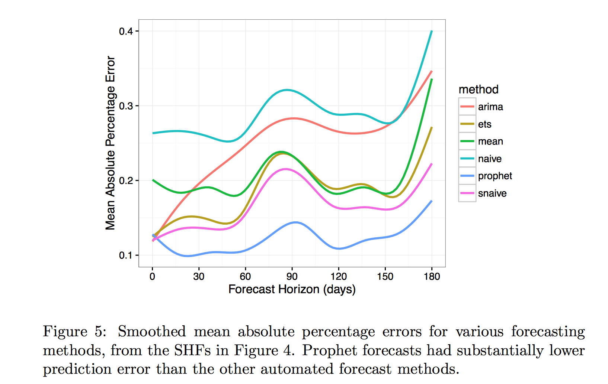

```{r setup, include=FALSE}
knitr::opts_chunk$set(echo = FALSE)
```
Agenda
========================================================
* What is Prophet
* Features

Prophet
========================================================
* Open Source (CRAN and PyPI)
* Time Series forecasting with model fitting in STAN
* CRAN Package : install.packages('prophet')
* Start here https://facebookincubator.github.io/prophet/
    + Intro for use in R and Python
    + Read the paper


Capabilities
========================================================
* Optimized for business forecasts
    + seasonality, irregular holidays, historical trend changes, growth saturation points
* Customizable in ways intuitive to non-experts
    + specify irregular holiday schedules, growth capacities, tweak parameters to fit
* Best with daily data with min one year of historical data.


The Model
========================================================
y(t) = g(t) + s(t) + h(t) + ε

g(t): growth function : Logistic growth model with non-constant carrying capacity with changepoints or linear growth model with changepoints. Changepoints are used to model changing rates of growth.

s(t): seasonality (weekly or yearly)

h(t): holidays

ε: error


Data for this demo
========================================================
* Fictional Sales Data 
* A mostly 5 day week operation
* Standard US holidays are observed


Data Format
========================================================
- 2 Columns - ds and y (date and value)
- For a logistic growth model a "cap" field is needed at every row.
```{r read data, echo=FALSE, message=FALSE}
setwd("~/Documents/Analytics/ProphetForecasting")  

library(prophet)
library(dplyr)
library(ggplot2)
library(tidyr)

df <- read.csv("DemoData.csv")
df$ds <- as.Date(df$ds, format="%m/%d/%Y")

summary(df)
```

Data Graph
========================================================
```{r plot data, echo=FALSE}
ggplot(data=df, aes(ds,y)) + geom_line()

```


Training Set
========================================================
Create a training set - let's use 2 years so we can let it detect growth/seasonality.
```{r train and fit, echo=TRUE}
df_train=df[df$ds < as.Date("2017-01-01"),]
summary(df_train)
```

Forecast Assumptions
========================================================
* Default assumption: Linear
* Can also specify a logistic growth model. Must provide a cap (historical and future)


Forecast - 30 Days Forward
========================================================
#### 30 Days forward

```{r forecast 30, echo=TRUE}
m <- prophet(df_train)
future <- make_future_dataframe(m, periods=30) #For a logistical growth model specify a fixed future cap
forecast <- predict(m,future)
```

Forecast Zoom in
========================================================
```{r prediction, echo=FALSE}
#plot(m, forecast)

ggplot()+
  geom_line(data=filter(df, (ds>=as.Date("2017-01-01") & ds<=as.Date("2017-01-28"))), aes(x=ds, y=y, color="Actual")) +
  geom_line(data=filter(forecast, (ds>=as.Date("2017-01-01") & ds<=as.Date("2017-01-28"))), aes(x=ds, y=yhat, color="Forecast"))


```

Forecast - 90 Days Forward
========================================================
#### 90 Days forward

```{r forecast 2, echo=TRUE}
m2 <- prophet(df_train)
future2 <- make_future_dataframe(m2, periods=90)
forecast2 <- predict(m2,future2)
```

Forecast - Zoom In
========================================================
```{r prediction 2, echo=FALSE}
#plot(m2, forecast2)
ggplot()+
  geom_line(data=filter(df, (ds>=as.Date("2017-01-01") & ds<=as.Date("2017-03-30"))), aes(x=ds, y=y, color="Actual")) +
  geom_line(data=filter(forecast2, (ds>=as.Date("2017-01-01") & ds<=as.Date("2017-03-30"))), aes(x=ds, y=yhat, color="Forecast"))
```


Forecast - Components
========================================================

```{r echo=TRUE}
prophet_plot_components(m, forecast)
```

Trend Changepoints
========================================================
* Default 25 changepoints first 80% of time series with sparse prior
* Not all changepoints used
* Can specify or have autodetect

Trend Changepoints
========================================================


Trend Changepoints - Specifying Change Points
========================================================
Control fit of model via changepoints

* You can:
    + Specify number of changepoints  <font color="red">n_changepoints</font>
    + Adjust strength of prior  <font color="red">changepoint_prior_scale</font> increase to make flexible
    + Specify location of changepoints  <font color="red">changepoints</font>


Forecast Uncertainty
========================================================
* Sources: trends, seasonality estimates, obervation noise
* Default: Trends (and noise): Compute distribution of historcal trend averages and magnitude
* Seasonality: Requires full [Bayesian Sampling](https://en.wikipedia.org/wiki/Gibbs_sampling), specify a param <font color="red">mcmc_samples</font>


Forecast Uncertainty Plotted
========================================================
```{r echo=TRUE}
plot(m, forecast)
```


Seasonality
========================================================
* Modeled as a fourier series
* Typical Aproximation Terms - 20 (year) and 6 (week)
* Smoothing priors for better fitting (can be specified via the parameter <font color="red">seasonality.prior.scale</font>)


Holidays
========================================================
Holidays can be incorporated into the series with a window around it to indicate change of behavior in that time frame

```{r, echo=TRUE, message=FALSE, warning=FALSE}

EoYholiday <-data.frame(
  holiday='thanksmas',
ds=as.Date(c('2015-11-26','2015-12-25','2016-11-24','2016-12-25')),
lower_window=1, upper_window=2)

SoYHoliday<-data.frame(
  holiday='memind',
  ds=as.Date(c('2015-1-1','2015-05-25','2015-07-04','2016-1-1','2016-05-30','2016-07-04', '2017-1-1')),
  lower_window=1, upper_window=0)

holidays <- bind_rows(EoYholiday,SoYHoliday)


```
Forecast with Holidays
========================================================


```{r predict with holidays, echo=TRUE, message=FALSE}
m2 <- prophet(df_train, holidays = holidays)
forecast2 <- predict(m2, future2)
prophet_plot_components(m2, forecast2)

```

Performance with Prophet
========================================================
```{r, echo=FALSE}
mape <- function(y, yhat)
  sum(abs(y-yhat))/sum(y)
mape30Day<-mape(df$y[1:length(forecast$yhat)],forecast$yhat)
mape90Day<-mape(df$y[1:length(forecast2$yhat)],forecast2$yhat)

```

* MAPE for 30 day prediction: `r mape30Day`
* MAPE for 90 day prediction: `r mape90Day`

Performance with Prophet
========================================================
* Performance of Prophet versus other forecasting methods ^1^
```{r, out.width = "600px"}

```

Analyst in the loop
========================================================
prophet(df = df, growth = "linear", changepoints = NULL,
  n.changepoints = 25, yearly.seasonality = TRUE,
  weekly.seasonality = TRUE, holidays = NULL,
  seasonality.prior.scale = 10, changepoint.prior.scale = 0.05,
  holidays.prior.scale = 10, mcmc.samples = 0, interval.width = 0.8,
  uncertainty.samples = 1000, fit = TRUE)
  
- Capacities  a low or declining capacity can be used to adjust the forecast downward or even to produce negative growt e.g. df$cap <- 100 can be specified for every row and is therefore non-constant.

- Changepoints - Known dates of changepoints can be directly specified, such as for example a new product model introduction.

- Holidays and seasonality - Holiday dates and the applicable time scales of seasonality can be added.

- Smoothing parameters - The seasonality (seasonality.prior.scale) and holiday smoothing (holidays.prior.scale) parameters allow the analyst to tell the model how much of the historical seasonal variation is expected in the future.

References
========================================================

[1] Taylor, S. J., & Letham, B. (2017, January 13). Forecasting at Scale. Retrieved from https://facebookincubator.github.io/prophet/static/prophet_paper_20170113.pdf


[2] Tutorial: https://facebookincubator.github.io/prophet/docs/installation.html

